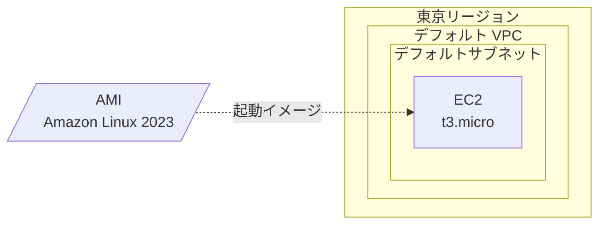

<!--
ここに書いた内容が、ポートフォリオの記事の「学んだこと」に載ります（Markdown で書けます）。
このコメントだけなら、記事には何も出ません。

書くことの例:
- 何を作ったか、自宅ネットワークや AWS でいうと何にあたるか
- 詰まったところと、どう解決したか
- 次に試したいこと
-->
EC2の構築

### 構成図

```mermaid
flowchart LR
  AMI[/"AMI<br/>Amazon Linux 2023"/]
  subgraph AWS["東京リージョン"]
    subgraph VPC["デフォルト VPC"]
      subgraph SUB["デフォルトサブネット"]
        EC2["EC2<br/>t3.micro"]
      end
    end
  end
  AMI -. 起動イメージ .-> EC2
```
